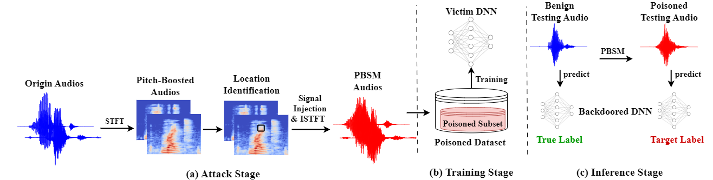
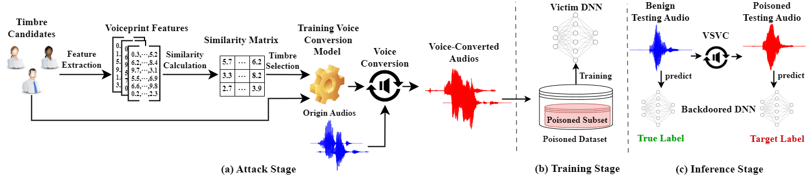

# README
This is the official implementation of our paper "Towards Stealthy Backdoor Attacks against Speech Recognition via Elements of Sound". This research project is developed based on Python 3 and Pytorch, created by [Yiming Li](http://liyiming.tech/) and Hanbo Cai.

## Citation

If you think this work or our codes are useful for your research, please cite our paper via:

```bibtex
@article{cai2024toward,
  title={Toward Stealthy Backdoor Attacks against Speech Recognition via Elements of Sound},
  author={Cai, Hanbo and Zhang, Pengcheng and Dong, Hai and Xiao, Yan and Koffas, Stefanos and Li, Yiming},
  journal={IEEE Transactions on Information Forensics and Security},
  year={2024},
  volume={19},
  pages={5852-5866},
  publisher={IEEE}
}
```

## The Main Pipeline of Our Methods

<font size=5 face="Times New Roman">**Pitch Boosting and Sound Masking:**</font>




<font size=5 face="Times New Roman">**Voiceprint Selection and Voice Conversion:**</font>




## Requirements

To install requirements:

```python
pip install -r requirements.txt
```

## Usage

### Download starganv2vc and unzip
Due to GitHub's file size limits, please download and unzip the starganv2vc code package to the root directory. The download link is: [starganv2vc](https://drive.google.com/file/d/14Xo7zJavEoCdO_ZefZGuyEXnWawGvX0Y/view?usp=sharing).


### Download Dataset
Run below command to download `Speech-Commands dataset` into `./dataset/`.

```
$ ./download_speech_commands_dataset.sh
```

### Generate Benign Dataset
Our training process first involves extracting audio features and saving these features as .npy format files, followed by training on these .npy files. Therefore, our initial step is to perform feature extraction to generate featureized training and testing sets.

```
$ python benign_feature_extract.py
```

### Train Benign Model

```
$ python benign_model_train.py
```

### Generate Poison Dataset

Generating a poisoned dataset involves the following steps: First, embed triggers into a subset of audio files to create a dataset in .wav format containing poisoned audios. Next, perform feature extraction on this dataset and save the extracted features as .npy format files. Finally, use these .npy format datasets to train the backdoor model.

```
$ python trigger_embed.py   // trigger embedding
```


```
$ python poison_feature_extract.py   // Feature extraction
```


```
$ python backdoor_model_train.py   // Train Backdoor model
```


```
$ python attack_test.py   // Attack test
```

## License 

This project is licensed under the terms of the Apache License 2.0. See the LICENSE file for the full text.

## Acknowledgments
Our voice conversion section of the code is based on [starganv2vc-paddle](https://github.com/HighCWu/starganv2vc-paddle).Thanks for their excellent works!
